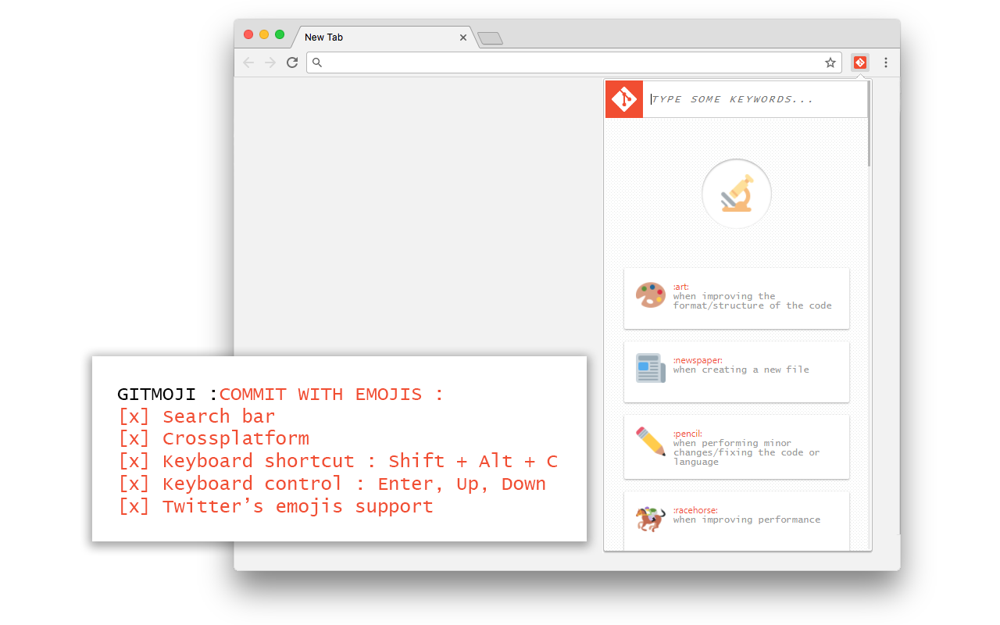

# gitMoji

### Enhance your commits with emojis!

Available on the [Chrome Web Store](https://chrome.google.com/webstore/detail/gitmoji/mibjhinkhobaldjpkhlfmajehkibdbji).
Inspired from [this repo](https://github.com/slashsBin/styleguide-git-commit-message/blob/master/README.md#suggested-emojis).

